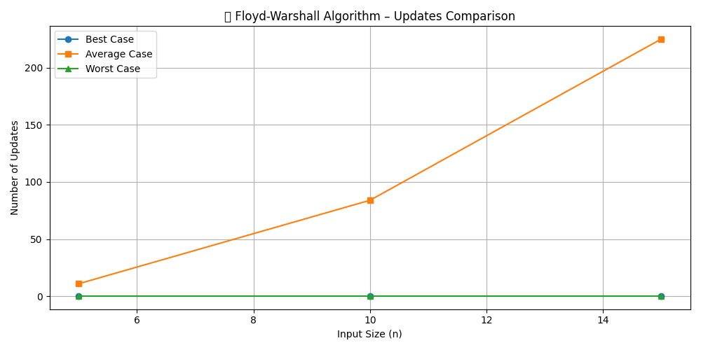

# Floyd-Warshall Algorithm Analysis

## Overview
This project analyzes the **Floyd-Warshall Algorithm**, an all-pairs shortest path algorithm, using a **step and update count approach**. The goal is to study how the algorithm performs on different types of inputs:

- **Best Case**: All distances are zero.
- **Average Case**: Random values in the matrix.
- **Worst Case**: All distances are large (100), no updates possible.

---

## How It Works
The Floyd-Warshall algorithm is implemented with three nested loops:
```cpp
for (int k = 0; k < n; k++)
    for (int i = 0; i < n; i++)
        for (int j = 0; j < n; j++)
```
Each triple loop represents one **step**. Whenever the distance is updated (i.e., a shorter path is found), we increment the **update counter**.

### Input Sizes Tested:
- 5
- 10
- 15

---

## Code:
```cpp
#include <iostream>
#include <vector>
#include <cstdlib>
using namespace std;

void floydWarshall(vector<vector<int>>& dist, int n){
    int updateCount=0;
    for(int k=0; k<n; k++){
        for(int i=0; i<n; i++){
            for(int j=0; j<n; j++){
                if(dist[i][k] + dist[k][j]<dist[i][j]){
                    dist[i][j]=dist[i][k] + dist[k][j];
                    updateCount++;
                }
            }
        }
    }

    cout<<"Updates: " <<updateCount <<endl;
}

void floydAnalysis(){
    vector<int> inputSizes={5, 10, 15};

    for(int size : inputSizes){
        cout <<"======================= " <<size <<" =======================\n";

        vector<vector<int>> best;
        for(int i=0; i<size; i++){
            vector<int> row(size, 0);
            best.push_back(row);
        }
        cout <<"Best Case: ";
        floydWarshall(best, size);

  
        vector<vector<int>> average;
        for(int i=0; i<size; i++){
            vector<int> row(size);
            for(int j=0; j<size; j++){
                row[j]=rand() % 10 + 1;
            }
            average.push_back(row);
        }
        cout <<"Average Case: ";
        floydWarshall(average, size);


        vector<vector<int>> worst;
        for(int i=0; i<size; i++){
            vector<int> row(size, 100);
            row[i]=0;
            worst.push_back(row);
        }
        cout <<"Worst Case: ";
        floydWarshall(worst, size);

        cout <<"============================================================\n";
    }
}

int main(){
    floydAnalysis();
    return 0;
}

```

---

## Output:
```
======================= 5 =======================
Best Case: Updates: 0
Average Case: Updates: 11
Worst Case: Updates: 0
============================================================
======================= 10 =======================
Best Case: Updates: 0
Average Case: Updates: 84
Worst Case: Updates: 0
============================================================
======================= 15 =======================
Best Case: Updates: 0
Average Case: Updates: 225
Worst Case: Updates: 0
============================================================
```

---

## Floyd-Warshall Algorithm Analysis (Updates)

| Input Size | Case         | Updates |
|------------|--------------|---------|
| 5          | Best Case    | 0       |
| 5          | Average Case | 11      |
| 5          | Worst Case   | 0       |
| 10         | Best Case    | 0       |
| 10         | Average Case | 84      |
| 10         | Worst Case   | 0       |
| 15         | Best Case    | 0       |
| 15         | Average Case | 225     |
| 15         | Worst Case   | 0       |

---
## Graphs

## Complexity Analysis
The Floyd-Warshall algorithm runs in **O(n^3)** time due to the triple nested loop, regardless of input type.

### Behavior by Case:
- **Best Case**: No updates needed — all paths already optimal.
- **Average Case**: Some updates made — useful analysis of practical scenarios.
- **Worst Case**: No shorter paths — all values too large.

---

## Compilation & Execution
```sh
g++ floyd_analysis.cpp -o floyd_analysis
./floyd_analysis
```

---

## Author
- **Anurag Nidhi**

