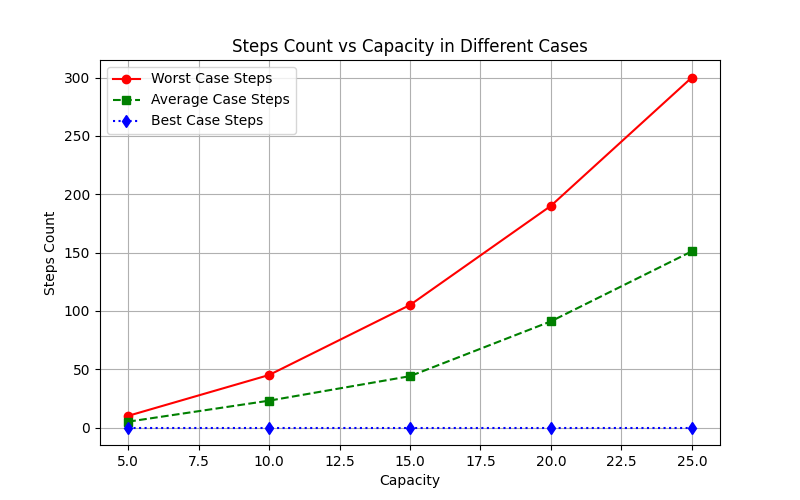

# Longest Increasing Subsequence (LIS) Analysis

## Overview
This project analyzes the time complexity of the **Longest Increasing Subsequence (LIS)** algorithm using **dynamic programming**. It evaluates LIS performance in three different cases:
- **Worst Case**: A strictly increasing sequence.
- **Average Case**: A randomly generated sequence.
- **Best Case**: A strictly decreasing sequence.

The program calculates the **number of steps** taken to compute the LIS and the **maximum length** of the subsequence for different input sizes.

---

## How It Works
The LIS function uses a **dynamic programming approach** where:
- `dp[i]` stores the length of the LIS ending at index `i`.
- For each element `arr[i]`, we check all previous elements `arr[j]` where `j < i` and update `dp[i]` accordingly.
- The algorithm iterates through the array, updating `dp` values and counting steps.

The **step count** represents the number of comparisons made in the nested loops.

### Input Sizes Tested:
- 5
- 10
- 15
- 20
- 25
### Code :
```cpp
#include<iostream>
#include<vector>
#include<algorithm>
#include<cstdlib>
using namespace std;

int lis(vector<int>& arr) {
    int n = arr.size();
    vector<int> dp(n, 1);
    int stepCount = 0;
    for(int i=1;i<n;i++){
        for(int j=0;j<i;j++) {
            if (arr[i]>arr[j]) {
                dp[i]=max(dp[i],dp[j]+1);
                stepCount++;
            }
        }
    }
    int maxLength = *max_element(dp.begin(), dp.end());
    cout<<"Steps: "<<stepCount<<endl;
    cout<<"Max Length: "<<maxLength<<endl;
    return maxLength;
}
 void lisAnalysis() {
    vector<int> inputSizes = {5, 10, 15, 20, 25};
    for(int size : inputSizes){

        cout<<"=========================== "<<size<<" ==========================="<<endl;
        vector<int> worst(size);
        for(int i=0;i<size;i++){
            worst[i]=i+1;
        }
        cout<<"worst Case: ";
        lis(worst);

        vector<int> average(size);
        for(int i=0;i<size;i++){
            average[i]=rand()%100;
        }
        cout<<"Average Case: ";
        lis(average);

        vector<int> best(size);
        for(int i=0;i<size;i++){
            best[i]=size-i;
        }
        cout<<"best Case: ";
        lis(best);

        cout<<"==================================================================="<<endl;

    }
    cout<<endl;
}
int main() {
    lisAnalysis();
    return 0;
}
```
### Output :
```cpp
=========================== 5 ===========================
worst Case: Steps: 10
Max Length: 5
Average Case: Steps: 5
Max Length: 3
best Case: Steps: 0
Max Length: 1
===================================================================
=========================== 10 ===========================
worst Case: Steps: 45
Max Length: 10
Average Case: Steps: 23
Max Length: 5
best Case: Steps: 0
Max Length: 1
===================================================================
=========================== 15 ===========================
worst Case: Steps: 105
Max Length: 15
Average Case: Steps: 44
Max Length: 5
best Case: Steps: 0
Max Length: 1
===================================================================
=========================== 20 ===========================
worst Case: Steps: 190
Max Length: 20
Average Case: Steps: 91
Max Length: 7
best Case: Steps: 0
Max Length: 1
===================================================================
=========================== 25 ===========================
worst Case: Steps: 300
Max Length: 25
Average Case: Steps: 151
Max Length: 7
best Case: Steps: 0
Max Length: 1
===================================================================
```

---

## Code Explanation

### `lis(vector<int>& arr)`
- Computes the LIS using a **dynamic programming approach**.
- Uses a **nested loop** to compare elements and update `dp`.
- Returns the **maximum LIS length** while printing step count.

### `lisAnalysis()`
- Generates test cases for **Worst, Average, and Best case scenarios**.
- Calls `lis()` on each case and prints the results.

### `main()`
- Runs `lisAnalysis()` to perform LIS computation on different input sizes.

---

## Graphical Representation
 
---
## Complexity Analysis
The LIS algorithm using dynamic programming has a **time complexity of O(n²)** because of the nested loop iterating through previous elements.

- **Best Case (Strictly Decreasing Sequence)**: O(n) (Minimal comparisons)
- **Worst Case (Strictly Increasing Sequence)**: O(n²) (All comparisons made)
- **Average Case (Random Sequence)**: Between O(n) and O(n²)

---

## Running the Program
### Requirements
- C++ Compiler (g++ or similar)

### Compilation and Execution
```sh
 g++ lis_analysis.cpp -o lis_analysis
 ./lis_analysis
```

## Author
- **Anurag Nidhi**

---


