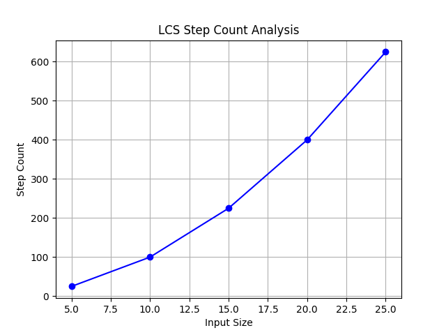

# LCS Algorithm Analysis

## Overview

This program analyzes the **Longest Common Subsequence (LCS)** algorithm by calculating the number of steps required for different input sizes.

## How It Works

1. The program generates two random strings of a given length.
2. It runs the **LCS algorithm** using dynamic programming.
3. The results, including step counts and LCS length, are printed to the console.

## Code Breakdown

- **lcs()**: Implements the dynamic programming approach to find the longest common subsequence and counts the number of steps.
- **analyzeLCS()**: Runs the LCS algorithm on different input sizes and logs the results.
- **main()**: Calls the analysis function to execute the program.

## Code

```cpp
#include <iostream>
#include <vector>
#include <cstdlib>
#include <ctime>
using namespace std;

int lcs(string s1,string s2){
    int n=s1.length();
    int m=s2.length();
    vector<vector<int>> dp(n + 1,vector<int>(m + 1,0));
    int stepCount=0;
    
    for(int i=1;i<=n;i++){
        for(int j=1;j<=m;j++){
            stepCount++;
            if(s1[i-1]==s2[j-1]){
                dp[i][j]=dp[i-1][j-1] + 1;
            } else{
                dp[i][j]=max(dp[i-1][j],dp[i][j-1]);
            }
        }
    }
    cout<<"Steps: "<<stepCount<< endl;
    return dp[n][m];
}

void analyzeLCS(){
    vector<int> inputSizes ={5,10,15,20,25};
    for(int size : inputSizes){
        string s1(size,'A'+rand()%26);
        string s2(size,'A'+rand()%26);
        cout<<"Input Size: "<<size<<" -> ";
        lcs(s1,s2);
    }
}

int main(){
    analyzeLCS();
    return 0;
}
```

## Output Example

```cpp
Input Size: 5 -> Steps: 25
Input Size: 10 -> Steps: 100
Input Size: 15 -> Steps: 225
Input Size: 20 -> Steps: 400
Input Size: 25 -> Steps: 625
```

## Graph



## Time Complexity

- **LCS Algorithm (Dynamic Programming)**: \(O(n \times m)\), where \(n\) and \(m\) are the lengths of the input strings.

## Requirements

- C++ Compiler (e.g., g++)
- Standard Library (vector, iostream, ctime)

## Notes

- The **LCS algorithm** efficiently computes the longest subsequence shared by two strings using a 2D table.
- The **step count grows quadratically** with input size, making it computationally expensive for large strings.
- The **graph** represents the relationship between input size and the number of steps required.